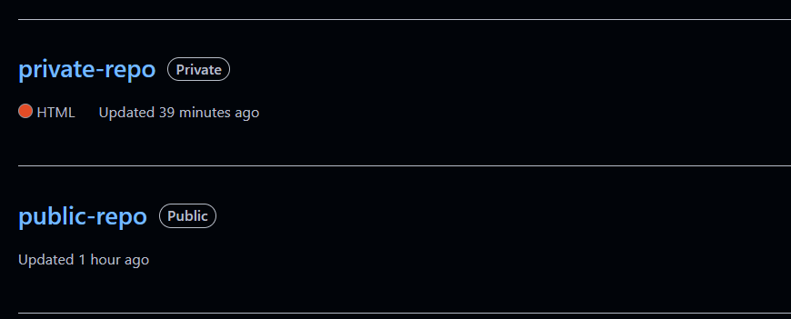
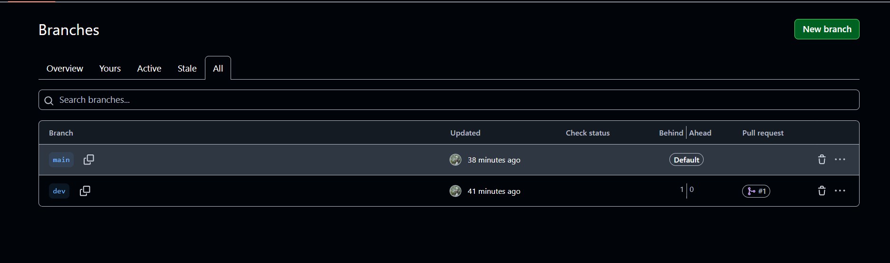
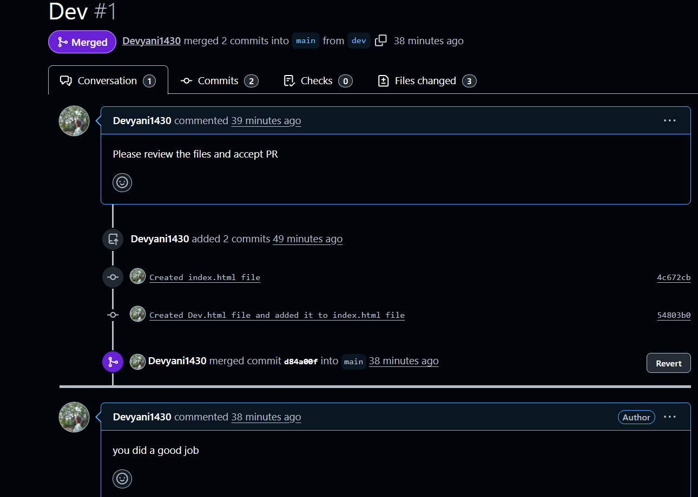
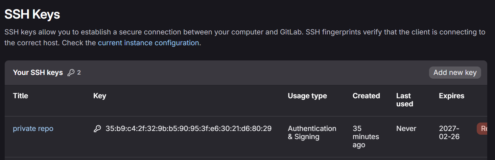
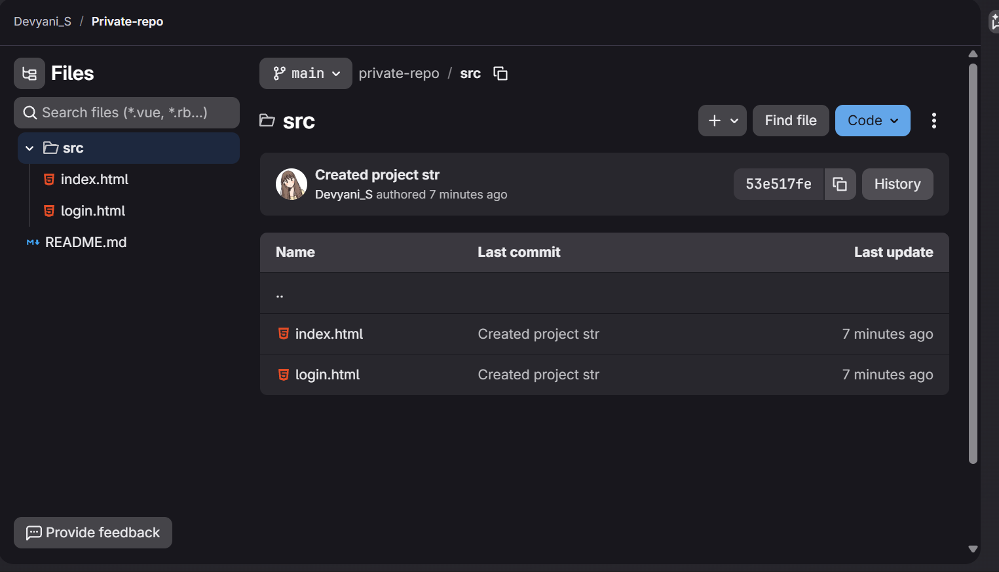
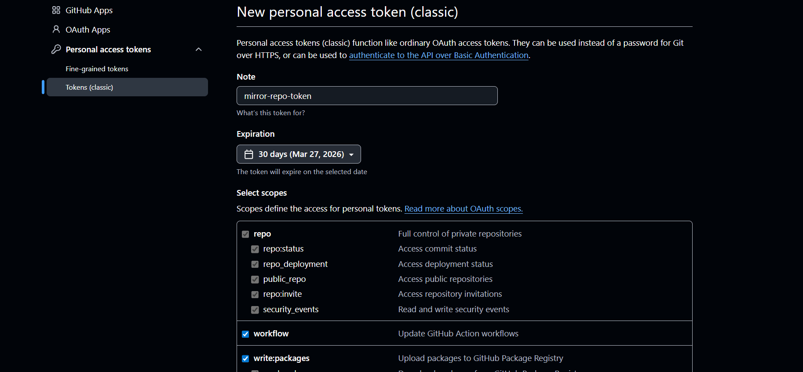
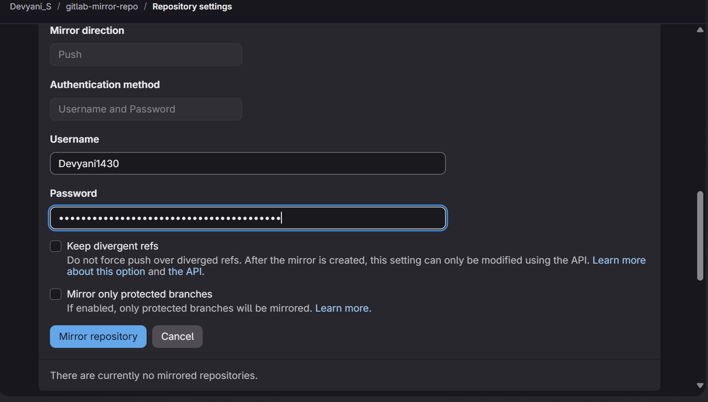
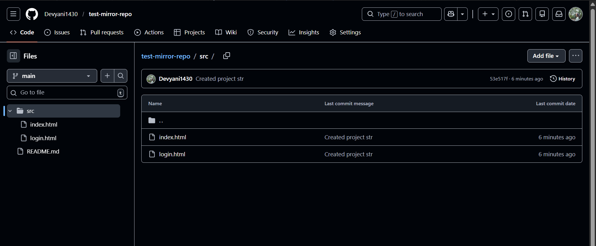
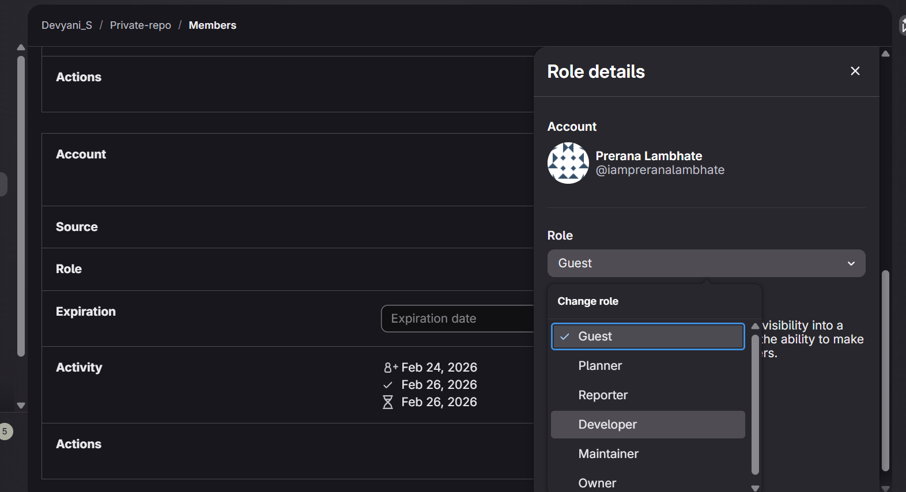

# Succesfully completed the Tasks:

## 1. Public and private Reposetories

## 2. Created branch , added files and pushed branch to github

## 3. Created PR nad Merged 

## 4. Created private repo in gitlab, took access with ssh and creted src/index.html project structure

## 5. Created personel access token on git hub and mirror repository from git lab to github.

## Successfully created mirror repo
github mirror repo :

gitlab repo :

## Invited a Friend and changed role from guest to developer

